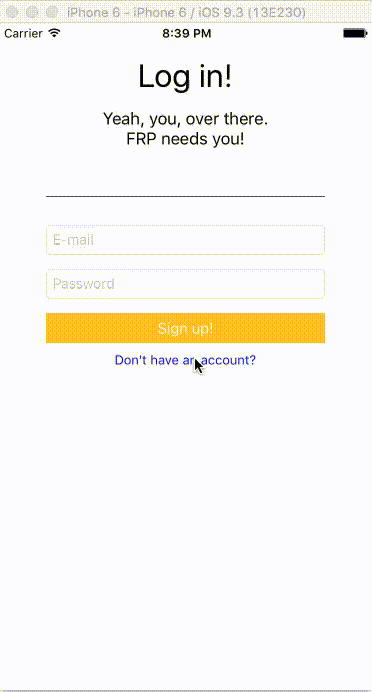

# RxLoginScreen - RxDataSources example

-----
The code in this repository shows one case of using RxDataSources - login screen.
[Original Medium post](https://medium.com/@charlag/complex-table-view-state-changes-made-automatically-99096ad0672b#.4cyme2a3v)
